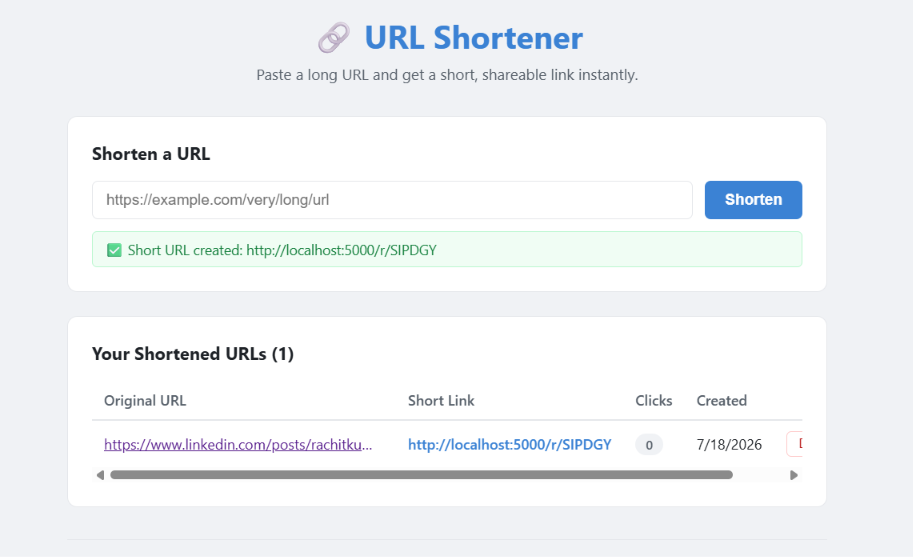

# 🔗 MERN Stack URL Shortener

<p align="center">
  
</p>

A simple and responsive **URL Shortener** built using the **MERN Stack** (MongoDB, Express.js, React.js, and Node.js). The application allows users to shorten long URLs, track click counts, manage links, and instantly redirect users to the original destination.

---

## ✨ Features

- 🔗 Shorten long URLs instantly
- 📊 Track click counts for each shortened URL
- 📋 View all shortened URLs
- 🗑️ Delete URLs
- ⚡ Fast REST API built with Express.js
- 💾 Persistent data storage using MongoDB
- 🎨 Responsive React user interface

---

## 🛠️ Tech Stack

### Frontend
- React.js
- Axios
- CSS

### Backend
- Node.js
- Express.js
- MongoDB
- Mongoose
- NanoID
- Dotenv
- CORS

---

## 📂 Project Structure

```text
mern-url-shortener/
│
├── backend/
│   ├── models/
│   │   └── Url.js
│   ├── routes/
│   │   └── urlRoutes.js
│   ├── .env
│   ├── server.js
│   └── package.json
│
├── frontend/
│   ├── public/
│   ├── src/
│   │   ├── components/
│   │   │   ├── UrlForm.jsx
│   │   │   └── UrlList.jsx
│   │   ├── App.jsx
│   │   ├── App.css
│   │   └── main.jsx
│   └── package.json
│
├── 1.png
└── README.md
```

---

## 🚀 Getting Started

### 1. Clone the Repository

```bash
git clone https://github.com/rachitkumarsingh10/mern-url-shortener.git
cd mern-url-shortener
```

---

## ⚙️ Backend Setup

Navigate to the backend folder:

```bash
cd backend
npm install
```

Create a `.env` file:

```env
MONGO_URI=mongodb://localhost:27017/urlshortener
PORT=5000
BASE_URL=http://localhost:5000
```

For MongoDB Atlas:

```env
MONGO_URI=your_mongodb_atlas_connection_string
```

Start the backend server:

```bash
npm run dev
```

---

## 💻 Frontend Setup

Open another terminal:

```bash
cd frontend
npm install
npm run dev
```

Open your browser:

```
http://localhost:5173
```

---

## 📡 API Endpoints

| Method | Endpoint | Description |
|--------|----------|-------------|
| POST | `/api/urls` | Create a shortened URL |
| GET | `/api/urls` | Get all URLs |
| GET | `/r/:code` | Redirect to original URL |
| DELETE | `/api/urls/:id` | Delete a URL |

---

## 📦 Sample API Request

### Create Short URL

```http
POST /api/urls
```

Request Body

```json
{
  "originalUrl": "https://www.google.com"
}
```

Response

```json
{
  "_id": "...",
  "originalUrl": "https://www.google.com",
  "shortCode": "aB12Cd",
  "shortUrl": "http://localhost:5000/r/aB12Cd",
  "clicks": 0
}
```

---

## 🗄️ Database Schema

```javascript
{
  originalUrl: String,
  shortCode: String,
  shortUrl: String,
  clicks: Number,
  createdAt: Date
}
```

---

## 🔄 Application Workflow

```text
User
 │
 ▼
Enter Long URL
 │
 ▼
React Frontend
 │
 ▼
Axios POST Request
 │
 ▼
Express API
 │
 ▼
Generate Short Code (NanoID)
 │
 ▼
Store in MongoDB
 │
 ▼
Return Short URL
 │
 ▼
Display to User
```

### Redirect Flow

```text
User Opens Short URL
        │
        ▼
Express Route
        │
        ▼
Find URL in MongoDB
        │
        ▼
Increase Click Count
        │
        ▼
Redirect to Original URL
```

---

## 🧩 Key Technologies

| Technology | Purpose |
|------------|---------|
| React.js | Frontend UI |
| Node.js | Backend Runtime |
| Express.js | REST API |
| MongoDB | Database |
| Mongoose | MongoDB ODM |
| Axios | HTTP Requests |
| NanoID | Short URL Generation |

---

## 🐞 Common Issues

| Issue | Solution |
|-------|----------|
| MongoDB connection error | Verify `MONGO_URI` |
| CORS error | Enable CORS middleware |
| Modules not found | Run `npm install` |
| Backend not starting | Check `.env` values |
| Blank frontend | Check browser console |

---

## 🚀 Future Improvements

- 🔐 JWT Authentication
- ✏️ Custom Short URLs
- 📱 QR Code Generation
- ⏳ URL Expiration
- 📈 Analytics Dashboard
- 📋 Copy to Clipboard
- 🔍 Search & Filter URLs
- 📄 Pagination
- 🌙 Dark Mode
- 🛡️ Rate Limiting

---

## 🤝 Contributing

Contributions are welcome!

1. Fork the repository

2. Create a feature branch

```bash
git checkout -b feature-name
```

3. Commit your changes

```bash
git commit -m "Add new feature"
```

4. Push to GitHub

```bash
git push origin feature-name
```

5. Open a Pull Request

---

## 📄 License

This project is licensed under the **MIT License**.

---

## 👨‍💻 Author

**Rachit Kumar Singh**

- **GitHub:** https://github.com/rachitkumarsingh10
- **LinkedIn:** https://linkedin.com/in/rachitkumarsingh10

---

⭐ **If you found this project useful, consider giving it a Star!**


git 